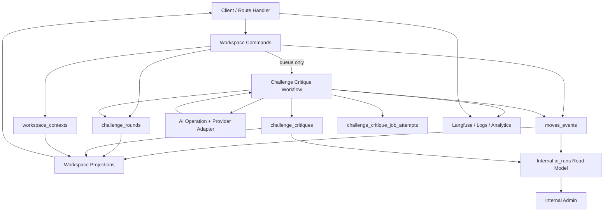

# Challenge Spine Architecture

- Status: active
- Date: 2026-04-23
- Owner: backend
- Scope: Penny challenge flow and adjacent support systems

## Purpose

This document explains the backend boundary that keeps Penny's challenge flow coherent:

- the **challenge spine** owns canonical challenge state
- **support systems** can observe, enrich, retry, evaluate, or render that state
- support systems must not replace the spine as source of truth

The main failure mode this document is trying to prevent is contributors collapsing these layers together and letting projections, analytics, provider details, or admin tooling quietly become product logic.

## Architecture Diagram

## What Belongs In The Spine

The challenge spine is the minimum set of state and code that defines what Penny believes happened.

### Canonical spine responsibilities

- accepting validated challenge commands
- creating and updating `challenge_rounds`
- writing durable domain events to `moves_events`
- persisting generated critiques in `challenge_critiques`
- keeping `workspace_contexts` as backend-owned mode/selection state
- invalidating and rebuilding projections from persisted state

### Spine code surfaces

- commands: [`src/server/workspace-commands.ts`](../src/server/workspace-commands.ts)
- async critique workflow: [`src/server/challenge-critique-workflow.ts`](../src/server/challenge-critique-workflow.ts)
- projections: [`src/server/workspace-projections.ts`](../src/server/workspace-projections.ts)
- schema: [`src/db/schema.ts`](../src/db/schema.ts)

### Spine tables

- `challenge_rounds`
- `challenge_critiques`
- `moves_events`
- `workspace_contexts`
- supporting core tables such as `maps` and `claims`

## What Must Stay Out Of The Spine

These systems are useful, but they are not canonical challenge state:

- provider-specific HTTP details
- Langfuse traces and observation ids
- PostHog analytics
- internal `ai_runs` inspection views
- job-attempt monitoring tables
- replay/eval outputs under `evals/`
- support/admin pages under `/internal`

If any of these disappear, Penny should still be able to reconstruct the user-visible challenge state from spine tables.

## What Is Safe To Parallelize

Safe to parallelize means the work can happen after or beside the canonical write without redefining what the domain write means.

### Safe

- queuing critique generation after the round exists
- provider execution inside the async critique workflow
- analytics emission after the response is already determined
- Langfuse trace logging
- challenge critique job monitoring
- `ai_runs` inspection queries and admin rendering
- offline replay, scoring, and evaluation
- support seeding for local or staging environments

### Not safe

- creating a round and generating a critique in one client-owned optimistic step
- writing challenge outcomes only to analytics or admin tables
- deriving canonical claim or round state from internal admin surfaces
- letting provider failure/success state bypass domain events and round updates
- letting the frontend assemble canonical challenge state from multiple raw backend fragments

## Event Model Overview

`moves_events` is the durable event log for meaningful domain writes.

### Core event roles

- audit trail for domain changes
- projection input for Brain / Challenge / Learn views
- durable record of accepted state transitions

### Challenge event examples

- `challenge.round.started`
- `challenge.critique.requested`
- `challenge.critique.generated`
- `challenge.response.recorded`
- `workspace.selection.changed`

### Event model rules

- write the domain event when the domain change is accepted
- do not write support-only operational noise into `moves_events`
- do not treat analytics events as substitutes for domain events
- projections may summarize events, but must not rewrite their meaning

## Projection Ownership

Projections are backend-owned read models over persisted state. They are not miniature workflows.

### Projection responsibilities

- shape Brain / Challenge / Learn responses for the frontend
- summarize persisted state into mode-specific payloads
- expose challenge critique status such as `pending`, `failed`, `validation_failed`, or `ready`
- stay derived from persisted command/workflow outputs

### Projection non-responsibilities

- generating critiques
- deciding whether a write is valid
- inventing workspace context on the client
- becoming a second source of truth for round state

Current owner:

- [`src/server/workspace-projections.ts`](../src/server/workspace-projections.ts)

## `ai_runs` Purpose

Penny currently has no first-class `ai_runs` table.

The current `ai_runs` concept is a **support read model** used by operators:

- generated runs are read from `challenge_critiques`
- requested-only runs are read from `moves_events`
- Langfuse metadata is surfaced from `_aiRun` inside `challenge_critiques.validated_output`

This means `ai_runs` is for:

- inspection
- debugging
- operator filtering
- support tooling

It is not for:

- canonical challenge writes
- workflow coordination
- deciding whether a critique is the product truth

Current implementation:

- query helper: [`src/server/internal-ai-runs.ts`](../src/server/internal-ai-runs.ts)
- API: [`src/app/api/internal/ai-runs/route.ts`](../src/app/api/internal/ai-runs/route.ts)
- admin page: [`src/app/internal/ai-runs/page.tsx`](../src/app/internal/ai-runs/page.tsx)

## Provider Abstraction Rules

Provider adapters are transport boundaries, not business logic owners.

### Provider layer is allowed to own

- HTTP request formatting
- parsing vendor responses
- usage/cost extraction
- vendor-specific error strings

### Provider layer must not own

- challenge round persistence
- domain event writing
- workspace context changes
- projection assembly
- admin/run inspection semantics

Current provider boundary:

- Anthropic adapter: [`src/server/ai/providers/anthropic.ts`](../src/server/ai/providers/anthropic.ts)
- xAI adapter: [`src/server/ai/providers/xai.ts`](../src/server/ai/providers/xai.ts)
- operation orchestration: [`src/server/ai/operations/generateChallengeCritique.ts`](../src/server/ai/operations/generateChallengeCritique.ts)

## Observability Boundaries

Observability must describe the system without becoming part of the canonical write contract.

### Allowed observability surfaces

- Langfuse traces and observations
- logger output
- PostHog challenge analytics
- challenge critique job attempts
- internal admin inspection

### Boundary rules

- observability can read spine state, but must not redefine it
- analytics failures are not product failures
- Langfuse ids are useful metadata, not canonical ids
- job monitoring is operational support state, not domain truth
- admin pages may explain missing data, but must not invent successful writes

## Contributor Checklist

Before adding challenge-related functionality, check:

1. Is this a canonical write or only support/observation?
2. If it is canonical, does it belong in commands + domain tables + domain events?
3. If it is observational, can it run after the write or from persisted state only?
4. If it changes a UI mode, is the source of truth still backend-owned `workspace_contexts` and projections?
5. If it touches AI providers, is the change limited to transport/validation rather than domain semantics?
