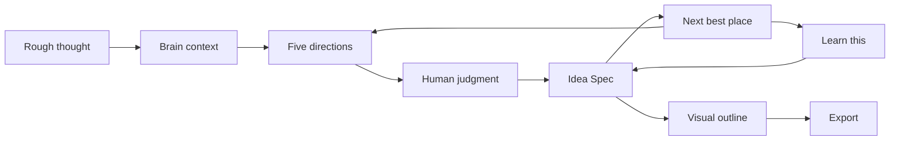

# Penny Create Operating Outline

Status: working product outline for Penny Create
Date: May 23, 2026

## North Star

Penny Create helps creative builders turn scattered thoughts into structured, buildable direction.

It is a new kind of writing surface: instead of putting thoughts into a blank page, the builder puts thoughts into an AI workbench that remembers context, stimulates better thinking, spots weak logic, and helps the builder decide what to make next.

The product should feel like:

> Give your thoughts structure, catch the weak parts, and make creativity grow instead of flattening it.

Penny is not a generic chatbot, notes app, productivity dashboard, or connector hub. It is a memory-native creativity workbench.

## Primary User

The first user is any creative builder trying to structure ideas.

That includes:

- A founder turning a vague startup instinct into a company direction.
- A programmer turning a bug, feature, or architecture concern into a build plan.
- A writer turning a loose essay idea into an outline.
- A designer turning taste and references into a product shape.
- A researcher turning fragments into a thesis.

The important commonality is not "startup founder." It is a person who makes things and needs their thoughts to become clearer without losing their own judgment.

## Create's Job

Create is the main workbench surface.

Create takes:

1. A rough idea.
2. Private Brain context.
3. Evidence from past notes, email-style sources, message transcripts, decisions, taste, rejected directions, and prior work.

Create returns:

1. Five meaningfully different options.
2. Clear source/evidence grounding.
3. A way for the user to select, reject, combine, and comment.
4. A living Idea Spec.
5. An automatic next-best-place continuation after each user action.
6. Learn bridges when a concept is confusing.
7. A visual outline.
8. An export prompt/spec that can drive a coding agent or another creative workflow.

## Core Loop

## The Five Directions

The five Create options should remain equal in visual weight. Penny can recommend the next best place to go, but it should not make the UI feel like one card is the boss.

The current durable option set is:

- Personal: what this idea means given the user's own history, taste, and recurring interests.
- Practical: the smallest useful version that can actually be built.
- Valuable: where this creates real utility, willingness to pay, or durable value.
- Critical: the strongest objection, risk, or weak point.
- Weird: the surprising direction that may unlock originality.

The labels can stay stable for now. Their content should adapt by use case.

## Human Judgment

Penny should always help the user find the next most important place to go.

That does not mean Penny owns the decision. It means Penny acts like a sharp thinking partner:

- "This is probably the next load-bearing question."
- "This option seems most connected to your past evidence."
- "This risk is the thing that could make the idea collapse."
- "You can ignore me and follow the creative thread if that is where energy is."

The user must always be able to:

- Select one option.
- Multi-select options.
- Add a comment.
- Reject a direction.
- Ask Penny to explain.
- Move to another option because creative energy points there.

The product principle is guided agency, not autopilot.

The next-best-place behavior should feel automatic. When the user selects an option, adds a comment, asks to move forward, or presses into the next idea, Penny should immediately surface the next useful place to continue. That can be another option, a weak point, a Learn bridge, an Idea Spec section, or the export step. The user should not have to ask, "what now?"

This is one of Create's core functions: the workbench keeps the creative chain moving while still letting the human redirect.

## Idea Spec

The final artifact should be called `Idea Spec` in the UI.

Internally, code can still use `IdeaSpec` where that is cleaner, but the product language should be `Idea Spec`.

An Idea Spec is a structured idea object that can serve different use cases:

- Startup direction.
- Product spec.
- Bug fix plan.
- Essay outline.
- Technical design brief.
- Demo plan.
- Coding-agent prompt.

An Idea Spec should include:

- Seed thought.
- Selected option history.
- User comments and judgments.
- Evidence from the user's past.
- Product or creative thesis.
- Target user or audience.
- Problem.
- Why now.
- Core loop or argument.
- Key system pieces.
- Data/source assumptions.
- Moat or originality.
- Risks and weak points.
- Rejected directions.
- MVP or first draft scope.
- Next best move.
- Export prompt.

For the YC demo, Idea Spec should include the startup-specific sections:

- Product thesis.
- Target user.
- Problem.
- Why now.
- Core loop.
- Brain/memory layer.
- Create mode.
- Learn bridge.
- Data sources.
- Moat.
- Risks.
- MVP scope.
- Demo script.
- Build prompt/export.

## Evidence From The Past

Penny should use past context in two ways:

1. Evidence: concrete references from notes, email-style sources, message transcripts, prior projects, and decisions.
2. Taste: inferred patterns about what the user repeatedly values, rejects, or returns to.

The UI should make both visible, but it should distinguish them.

Evidence should feel like:

- "This came from a note/source."
- "This appeared in a message transcript."
- "This connects to a past project."

Taste should feel like:

- "You keep rejecting generic dashboards."
- "You return to controllable instruments over generic chat."
- "You seem to care about human judgment staying central."

Do not blur evidence and taste. Evidence is provenance. Taste is interpretation.

## Learn Bridge

Learn is not a separate mode for its own sake. In Create, Learn exists because the user may hit confusion while making a judgment.

Create should offer "Learn this" when:

- A concept is important but fuzzy.
- A risk depends on a technical or market idea.
- An option sounds promising but the user cannot yet evaluate it.
- The next-best move requires understanding a smaller concept.

The Learn bridge should answer:

- What this option means.
- Why Penny suggested it.
- A full worked example.
- The next smallest concept to understand.
- How this applies to the current Idea Spec.

Then it should return to Create without losing state.

## Canvas

Canvas should be a visual outline, not a separate product mode right now.

For Create, Canvas should show:

- The seed thought.
- The Brain evidence clusters.
- The five options.
- The selected options.
- The Idea Spec sections.
- The Learn bridge if used.
- The export/build prompt endpoint.

The YC demo canvas can stay simple:

Penny -> Brain -> Create -> Learn -> Export

Each node should have a tiny note. Edges should explain the relationship.

## Export

Export should be strong enough to paste into Codex, Claude Code, or another coding agent.

It should include:

- Rough idea.
- Selected option history.
- User comments.
- Personal context used.
- Source/memory evidence.
- Product goal.
- Non-goals.
- UX requirements.
- Frontend requirements.
- Backend requirements.
- Data/privacy requirements.
- Verification requirements.
- Implementation sequence.
- Acceptance tests.
- Do-not-break list.
- Definition of done.

Export should never claim live Gmail, LinkedIn, WhatsApp, iMessage, SMS, Slack, or other connector access unless that access is actually implemented and verified.

## Product Guardrails

Build toward Create when the work helps a creative builder turn private context into clearer structure.

Pause or cut work when it mostly creates:

- More connectors before the loop is great.
- Generic chatbot behavior.
- Generic dashboard surfaces.
- Broad document ingestion.
- OAuth demo risk.
- Social/network connector theater.
- A canvas system that competes with Create instead of clarifying it.
- A writing editor before Idea Spec has a strong structure.

## Decision Checklist

Before starting work, ask:

1. Does this make Create better at turning thoughts into structure?
2. Does this preserve human judgment?
3. Does this make memory/evidence more trustworthy?
4. Does this make the Idea Spec more useful?
5. Does this help the user find the next best place?
6. Does this avoid fake connector claims?
7. Is this demo-speedrun scope, or is it product expansion?

If the answer is unclear, write the ambiguity down before coding.

## Current Build Priority

The next product push should focus on:

1. Make Idea Spec feel like the durable output of Create.
2. Make the automatic next-best-place continuation visible without overriding the user.
3. Separate evidence from inferred taste in the UI.
4. Make option selection and comments feel fast enough for creative flow.
5. Make Canvas a readable outline of the current Idea Spec.
6. Make Export consistently useful as a coding-agent prompt.

## CMUX Workstreams

Use cmux as the coding cockpit.

Recommended surfaces:

- lead: owns scope, git status, commits, pushes, final verification.
- create-ui: owns landing -> Create, cards, selection, comments, Idea Spec UX.
- brain-evidence: owns fixture/manual sources, evidence chips, privacy copy, trainingUse=false.
- learn-canvas: owns Learn bridge, visual outline, return-to-Create state.
- export-verify: owns export prompt quality, tests, typecheck, build, browser smoke.
- preview: runs the local app at http://localhost:3007.

Each workstream should read this outline first and refuse broad connector/product-mode expansion.

## Settled Product Decisions

1. The user-facing artifact name is `Idea Spec`.
2. The UI should say `weak point`, `risk`, or `pressure test`. "BS" can remain an internal posture, not product copy.
3. Next-best-place guidance should appear automatically as the user continues into the next idea or action. It should not be only a static banner, rail, or manual button.

## Open Questions

1. Should Create support use-case templates, or should the same Idea Spec structure flex naturally for startup, bug fix, and essay?
2. What is the minimum evidence needed before Penny is allowed to infer taste?
